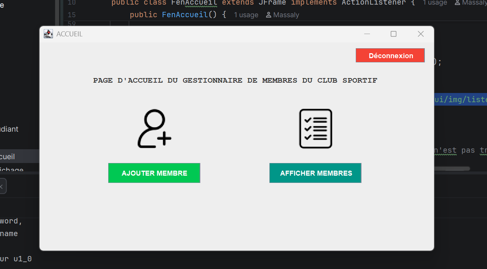

# Gestionnaire de Membres - Club Sportif UASZ

## 📌 Description du Projet
Ce projet est un mini-projet de **Programmation Avancée** réalisé dans le cadre du Master 1 Informatique à l'**Université Assane Seck de Ziguinchor (UASZ)**. 
L'objectif est de développer une application complète de gestion des membres du club sportif de l'université, en liant une interface graphique riche (**Java Swing**) à une base de données relationnelle (**PostgreSQL**) à l'aide de l'API de persistance **JPA (Hibernate)**.

L'application intègre une gestion sécurisée par authentification et applique des contrôles de validité stricts lors des processus d'inscription et de mise à jour des données.

---

## 🛠️ Technologies Utilisées
* **Langage :** Java (JDK 17 ou supérieur)
* **Interface Graphique :** Java Swing
* **Persistance / ORM :** JPA 3.0 / Hibernate
* **Base de Données :** PostgreSQL
* **Gestionnaire de Dépendances :** Maven (ou configuration manuelle via le fichier `persistence.xml`)

---

## 📐 Architecture du Projet
Le projet suit une architecture multicouche respectant les conventions de nommage demandées :
* `sn.uasz.m1.tp2.beans` : Contient les entités JPA (`Membre`, `Utilisateur`, `Sport`).
* `sn.uasz.m1.tp2.dao` : Contient les classes d'accès aux données (DAO) gérant les opérations CRUD avec JPA.
* `sn.uasz.m1.tp3.gui.exo2` : Contient les fenêtres de l'interface graphique Swing (`FenConnexion`, `FenAccueil`, `FenInscription`, `FenAffichage`).

---

## 🚀 Fonctionnalités Clés
1. **Authentification Sécurisée (`FenConnexion`) :** Filtrage des accès via la table `utilisateur`.
2. **Menu Principal Interactif (`FenAccueil`) :** Navigation intuitive avec affichage d'icônes graphiques personnalisées.
3. **Formulaire d'Inscription Dynamique (`FenInscription`) :**
   * Génération automatique de l'identifiant par la base de données.
   * Menu déroulant (`JComboBox`) pour les professions.
   * Initialisation automatique de la date d'adhésion.
   * **Contrôles de validité :** Prénom (2-40 caractères), Nom (2-20 caractères), vérification du format e-mail et de la cohérence de la date.
4. **Gestion de la Liste (`FenAffichage`) :** Affichage en temps réel dans un composant `JTable` avec fonctionnalités de modification interactive et de suppression après boîte de dialogue de confirmation.
5. **Système de Navigation Global :** Présence systématique des boutons de retour (`<< RETOUR`) et de déconnexion instantanée.

---

## 📦 Installation et Configuration

### 1. Base de données
Créez une base de données nommée `club_sportif` dans PostgreSQL. Les tables `membre`, `utilisateur` et `sport` seront automatiquement générées par Hibernate lors du premier lancement grâce à la propriété `javax.persistence.schema-generation.database.action` configurée dans votre fichier `persistence.xml`.

### 2. Configuration JPA
Ajustez vos identifiants de connexion PostgreSQL dans le fichier `src/main/resources/META-INF/persistence.xml` :
```xml
<property name="jakarta.persistence.jdbc.url" value="jdbc:postgresql://localhost:5432/club_sportif"/>
<property name="jakarta.persistence.jdbc.user" value="VOTRE_UTILISATEUR"/>
<property name="jakarta.persistence.jdbc.password" value="VOTRE_MOT_DE_PASSE"/>

